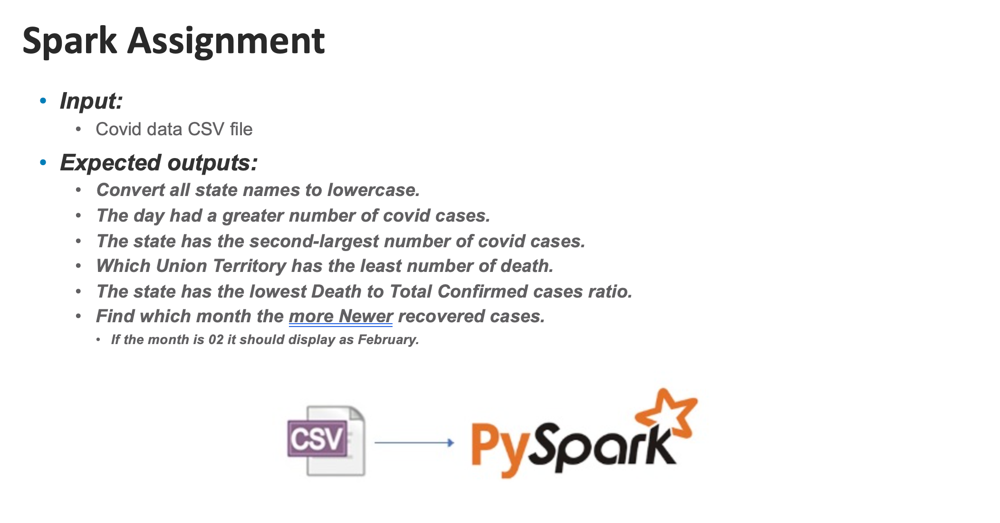

# COVID-19 Data Analysis using PySpark

## Overview

This project performs various analyses on a COVID-19 dataset using Apache Spark (PySpark). The dataset contains information such as confirmed cases, recovered cases, and deaths across different states and union territories of a country.

## Problem Statement

## Dataset

The dataset used in this project is a CSV file named `complete.csv`. It contains the following key columns:

- **Date**: The date of the recorded data.
- **Total Confirmed cases**: The total number of confirmed COVID-19 cases.
- **New recovered**: The number of newly recovered cases.
- **Name of State / UT**: The name of the state or union territory.
- **Death**: The number of deaths.

## **Outputs**:

The script will output the results of various analyses, including:

- State names converted to lowercase
- The day with the highest number of COVID-19 cases.
- The state with the second-largest number of COVID-19 cases.
- The union territory with the least number of deaths.
- The state with the lowest death-to-total confirmed cases ratio.
- The month with the highest number of newly recovered cases.

### Key DataFrames

- **df_with_month**: DataFrame with an additional `month` column extracted from the `Date` column.
- **df_monthly_recovery**: Aggregates and sums up the newly recovered cases by month.
- **df_top_recovery_month**: Final DataFrame that includes the month name with the highest number of newly recovered cases.
