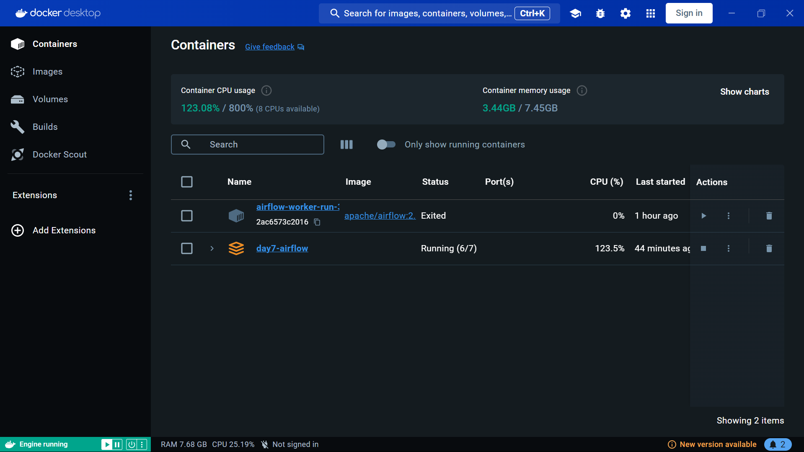
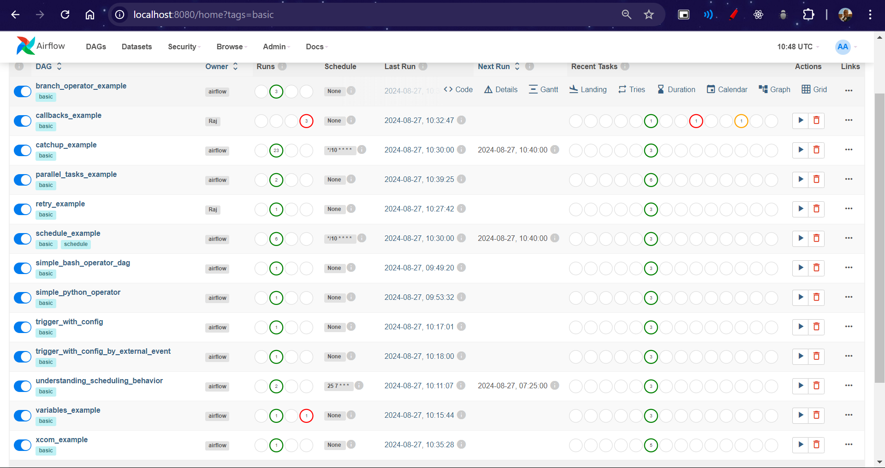

# Apache Airflow Introduction

## Overview

Apache Airflow, a powerful platform used for programmatically authoring, scheduling, and monitoring workflows. The session covers the basics of what Apache Airflow is, why it's useful, how it works, and includes hands-on practice with key concepts like operators, XComs, branching, retries, and more.

## What is Apache Airflow?

Apache Airflow is an open-source workflow automation tool used to manage and schedule complex data pipelines. It allows you to define workflows as directed acyclic graphs (DAGs) of tasks. Airflow’s flexibility and scalability make it ideal for orchestrating ETL processes, managing data science workflows, and automating repetitive tasks.

## Why Use Apache Airflow?

- **Scalability**: Easily handles complex workflows with hundreds or thousands of tasks.
- **Flexibility**: Allows for dynamic pipeline creation and modification using Python.
- **Monitoring and Alerting**: Provides tools for monitoring workflow execution and sending alerts if something goes wrong.
- **Extensibility**: A rich ecosystem of plugins and operators for integration with different services.
- **Community Support**: Active open-source community ensuring continuous development and support.

## How Apache Airflow Works

### Core Concepts

- **DAGs (Directed Acyclic Graphs)**: Represents a workflow, with nodes as tasks and edges as dependencies.
- **Tasks**: The building blocks of a DAG, representing a single operation.
- **Operators**: Predefined templates that determine what each task does (e.g., executing Python code, running a Bash script).
- **Scheduler**: Responsible for executing the tasks in the correct order and managing dependencies.
- **Executor**: Manages task execution, either locally, on a cloud platform, or with a distributed system.

### Key Features Covered in the Session

1. **BashOperator**: Executes a bash command.

   - Example: Run a shell script as a task in your workflow.

2. **PythonOperator**: Executes Python code.

   - Example: Run a Python function as part of the DAG.

3. **EmptyOperator**: Used for creating a task with no action; useful for placeholders or end-of-branch markers.

   - Example: Mark the start or end of a process.

4. **XComs (Cross-communication)**: Used to share data between tasks.

   - Example: Pass a result from one task to another.

5. **Branching**: Allows for conditional execution of tasks.

   - Example: Execute different tasks based on some criteria.

6. **Retries**: Specify the number of retry attempts for failed tasks.

   - Example: Retry a task three times if it fails.

7. **Catchup**: Determines whether past DAG runs should be executed if the DAG is started after its scheduled start date.

   - Example: Skip backfill runs to avoid overloading the system.

8. **Scheduling**: Defines when a DAG runs.

   - Example: Schedule a DAG to run daily at midnight.

9. **Variables**: Allows the storage of dynamic information that can be accessed by tasks.

   - Example: Use variables to store configuration values.

10. **Triggers**: External signals that can start a DAG.

    - Example: Trigger a DAG when a file is uploaded to a specific directory.

11. **Parallel Tasks**: Execute multiple tasks simultaneously, optimizing workflow efficiency.
    - Example: Run data extraction, transformation, and loading tasks in parallel.

## Hands-On Practice

During the session, we covered practical examples to demonstrate the above concepts. These examples helped you understand how to:

- Create and configure a basic DAG.
- Use different operators to define tasks.
- Implement error handling with retries.
- Pass data between tasks using XComs.
- Manage task dependencies with branching.
- Schedule and trigger workflows.
- Utilize parallel task execution for faster processing.

### Running Apache Airflow

To get started with Apache Airflow, we used Docker to set up the environment. The following steps were followed:

1. **Docker Setup**:
   - We used the `docker-compose.yaml` file provided on the official Airflow website [here](https://airflow.apache.org/docs/apache-airflow/2.5.1/docker-compose.yaml).
2. **Start Airflow**:
   - We ran the command `docker-compose up --build` to build and start the Airflow services.
   - This set up all necessary services including the web server, scheduler, and worker, enabling us to access the Airflow UI and start running our DAGs.

## Conclusion

Apache Airflow is a robust platform for managing complex workflows, offering flexibility, scalability, and extensibility. With a solid understanding of its core features and hands-on experience, you'll be well-equipped to build and manage data pipelines efficiently.
